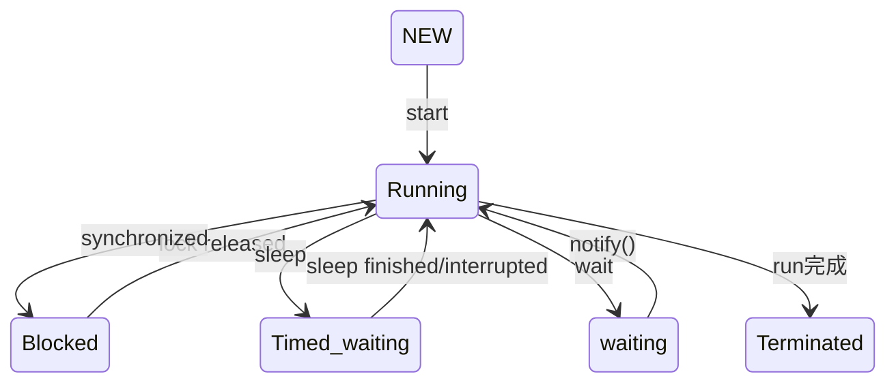

# Java线程

* 内核线程: 操作系统支持的线程, 由内核来完成切换, 通过内核调度器进行调度, 并且负责将线程映射到处理器内核上(或者说多个处理器上); 每个内核线程可以视为内核的一个分身
* 轻量级进程(LWP): 程序一般不直接使用内核线程, 而是使用内核线程的接口----轻量级进程, 即通常意义上讲的线程

## 线程的实现方式

### 内核线程方式

* 1个内核线程对应1个LWP, 也称为1:1方案
  * 线程基于内核线程的创建, 析构, 同步都需要用户态和内核态切换
  * 每个内核线程都消耗一定量的内核资源, 容纳的内核线程数有限

### 用户线程方式

* 一个内核线程对应多个用户线程: 1:N实现
* 用户线程的创建销毁完全在用户态完成, 无需切换
* 需要自己管理线程的切换, 调度, 如何将线程映射到多核处理器上, 总之实现很困难
* Java曾经使用过用户线程模式, 最终还是放弃了

### 混合实现

* 既存在轻量级进程, 也存在用户线程
* 用户线程的创建, 销毁在用户态完成, 不需要内核态切换
* 用户线程的调用通过轻量级进程完成
* 很多操作系统都有支持, 相对容易实现

### Java的线程实现

* JDK1.2前Classic虚拟机使用"绿色线程", 也就是用户线程方式
* 1.3起商用JVM普遍采用1:1线程模型

#### HotSpot为例进行分析

* HotSpot将Java线程映射到一个操作系统原生线程, 不干涉调度, 只提供优先级建议
* 何时冻结, 唤醒, 分配多少执行时间, 交给哪个处理器核心处理, JVM都不关系

## 线程调度

### 两种调度

* 协同式调度: 线程自己控制执行时间, 主动通知OS让其他线程执行
  * 上下文切换少, 但是执行时间不可控
* 抢占式调度: 由操作系统负责给线程分配CPU时间, 线程切换不由线程自己决定, 可以让出时间(yield), 但是不能获取执行时间

### Java的调度

* hotspot完全将调度交给OS, 仅通过10个优先级给操作系统提供建议,  同时处于Ready状态的线程优先级高的容易被OS调度

## Java的线程状态

* New(新建): 创建后未启动的线程
* Running(运行中): 线程拥有CPU资源, 正在运行
* Waiting: 等待被其他线程唤醒
* Timed waiting: 一段时间后被系统自动唤醒
* blocked: 被阻塞, 需要等待锁 

## Java与虚拟线程

* Java 19正式引入虚拟线程, 实现方案是Project Loom, 即Fiber(线程), 而不是Go那种协程

### 1:1线程模型的缺陷

* 切换, 调度成本高
* 密集IO的场景下, 线程频繁切换的成本非常高

### 协程需要攻克的问题

* 锁机制问题
  * 轻量级锁/重量级锁在对象头上记录的是线程id, 如果两个协程任务要执行的任务都需要某个锁, 但是最终由一个线程执行, 可能就会出现是否持有锁的错误判断
  * ThreadLocal
  * ...

### Java的虚拟线程方案

* 将原来需要创建M个线程的任务调度以虚拟线程的方式给N个线程去执行
  * 这N个线程负责任务的调度, 结果返回, 任务间的上下文切换不需要到内核态
  * 有点类似于线程池, 但是更轻量
